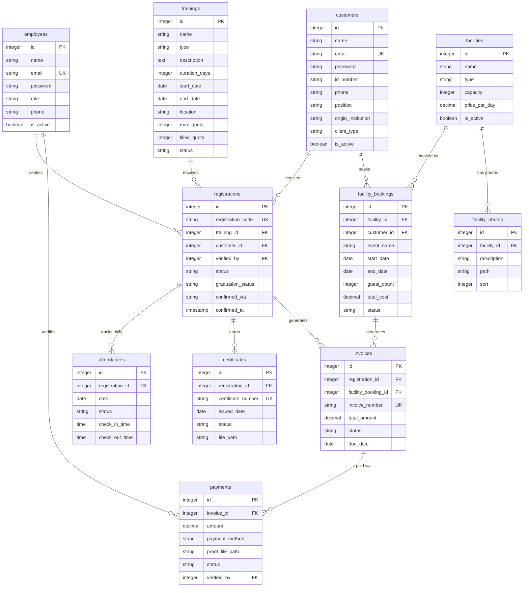

# Rencana Aksi: Migration Classes — Sistem Informasi Layanan BPKP Yogyakarta

Berdasarkan analisis [Tugas_PRD_Pendaftaran_Pelatihan.md](file:///home/kurnia/HTDOCS/layanan-publik/Tugas_PRD_Pendaftaran_Pelatihan.md), berikut rencana migration class lengkap.

## Kondisi Saat Ini

Migration yang sudah ada:
- [create_users_table.php](file:///home/kurnia/HTDOCS/layanan-publik/database/migrations/0001_01_01_000000_create_users_table.php) — `users`, `password_reset_tokens`, `sessions`
- `create_cache_table.php` — `cache`, `cache_locks`
- `create_jobs_table.php` — `jobs`, `job_batches`, `failed_jobs`

Stack: **Laravel 13** + **Filament v5** + **PostgreSQL ≥ 16**

---

## Revisi: Pemisahan Tegas Employees vs Customers

> [!NOTE]
> **Konsep utama**: Dua entitas pengguna yang terpisah tegas.
>
> | | **Employees** | **Customers** |
> |---|---|---|
> | **Siapa** | Staf internal (admin, operator, pimpinan) | Pengguna layanan publik (peserta, instansi) |
> | **Panel** | Admin, Pimpinan | Portal Klien |
> | **Auth** | Default Laravel guard | Guard terpisah (`customer`) |
> | **Tabel** | `employees` | `customers` |
> | **FK ke tabel lain** | `verified_by` di registrations & payments | `customer_id` di registrations & facility_bookings |

---

## User Review Required

> [!WARNING]
> **Modifikasi migration bawaan Laravel**: Karena project masih fresh (belum ada data), file [create_users_table.php](file:///home/kurnia/HTDOCS/layanan-publik/database/migrations/0001_01_01_000000_create_users_table.php) akan dimodifikasi langsung — mengganti `users` → `employees` dan menambah kolom profil. Ini lebih bersih daripada ALTER terpisah.

> [!WARNING]
> **Enum PostgreSQL**: Rencana ini menggunakan `string` column dengan PHP Enum casting di Model (bukan native PG enum type). Jika ingin native PG enum, beri tahu saya.

---

## Open Questions

> [!IMPORTANT]
> 1. **Layanan 3 (Sertifikasi)** — data yang dicatat belum diisi di PRD. Rencana ini mengasumsikan: `certificate_number`, `issued_date`, `status`, `file_path`.
> 2. **Pembayaran** — apakah ada integrasi payment gateway, atau hanya pencatatan manual oleh operator?

---

## Proposed Changes

### Diagram ERD (Entity Relationship)



---

### Urutan Migration Files

Semua PK menggunakan `$table->id()` (bigint auto-increment). Urutan disesuaikan agar FK dependency terpenuhi.

---

#### Migration 1: Employees (MODIFY existing file)

##### [MODIFY] [0001_01_01_000000_create_users_table.php](file:///home/kurnia/HTDOCS/layanan-publik/database/migrations/0001_01_01_000000_create_users_table.php)

Memodifikasi migration bawaan Laravel — mengganti `users` → `employees` dan menambah kolom profil:

| Column | Type | Description |
|--------|------|-------------|
| `id` | `id()`, PK | Auto-increment (bawaan) |
| `name` | `string` | Employee name (bawaan) |
| `email` | `string`, unique | Login email (bawaan) |
| `email_verified_at` | `timestamp`, nullable | (bawaan) |
| `password` | `string` | (bawaan) |
| `remember_token` | `rememberToken` | (bawaan) |
| `role` | `string`, default `'operator'` | `admin`, `operator`, `leader` |
| `phone` | `string`, nullable | Phone number |
| `is_active` | `boolean`, default `true` | Account active status |
| `avatar_url` | `string`, nullable | Profile photo |

| `timestamps` | — | (bawaan) |

Tabel `password_reset_tokens` dan `sessions` juga diperbarui FK-nya ke `employees`.

---

#### Migration 2: Customers (standalone)

##### [NEW] `2026_08_07_000002_create_customers_table.php`

Entitas customer **berdiri sendiri** — pengguna layanan publik, tanpa FK ke `employees`:

| Column | Type | Description |
|--------|------|-------------|
| `id` | `id()`, PK | Auto-increment |
| `name` | `string` | Full name |
| `email` | `string`, unique | Portal login email |
| `email_verified_at` | `timestamp`, nullable | Email verification |
| `password` | `string`, nullable | Portal login password (nullable jika didaftarkan oleh operator) |
| `remember_token` | `rememberToken` | For session persistence |
| `id_number` | `string`, nullable | NIK |
| `phone` | `string`, nullable | — |
| `position` | `string`, nullable | Position at institution |
| `origin_institution` | `string`, nullable | Origin institution |
| `client_type` | `string`, default `'individual'` | `individual`, `institutional` |
| `is_active` | `boolean`, default `true` | — |

| `timestamps` | — | `created_at`, `updated_at` |
| `softDeletes` | — | `deleted_at` |

---

#### Migration 3: Trainings

##### [NEW] `2026_08_07_000003_create_trainings_table.php`

Satu tabel pelatihan lengkap dengan jadwal dan kuota:

| Column | Type | Description |
|--------|------|-------------|
| `id` | `id()`, PK | Auto-increment |
| `name` | `string` | Training name |
| `type` | `string` | `technical`, `managerial`, `functional` |
| `description` | `text`, nullable | Training description |
| `duration_days` | `integer` | Duration in days |
| `requirements` | `text`, nullable | Prerequisites |
| `start_date` | `date` | Training start date |
| `end_date` | `date` | Training end date |
| `location` | `string` | Training venue |
| `max_quota` | `integer`, default `50` | Per business rule in PRD |
| `filled_quota` | `integer`, default `0` | Filled counter |
| `status` | `string`, default `'draft'` | `draft`, `open`, `full`, `ongoing`, `completed`, `cancelled` |
| `is_active` | `boolean`, default `true` | — |

| `timestamps` | — | — |
| `softDeletes` | — | — |

---

#### Migration 4: Registrations

##### [NEW] `2026_08_07_000004_create_registrations_table.php`

Pendaftaran pelatihan — menghubungkan **customer** ke **training**, diverifikasi oleh **employee**:

| Column | Type | Description |
|--------|------|-------------|
| `id` | `id()`, PK | Auto-increment |
| `registration_code` | `string`, unique | Reference number for client |
| `training_id` | `foreignId` → `trainings` | Training being registered for |
| `customer_id` | `foreignId` → `customers` | Customer registering |
| `verified_by` | `foreignId` → `employees`, nullable | Verifying operator |
| `status` | `string`, default `'pending'` | `pending`, `confirmed`, `rejected`, `cancelled` |
| `graduation_status` | `string`, default `'not_assessed'` | `not_assessed`, `passed`, `failed` |
| `notes` | `text`, nullable | Notes from customer |
| `operator_notes` | `text`, nullable | Notes from operator |
| `confirmed_at` | `timestamp`, nullable | Confirmation time |
| `confirmed_via` | `string`, nullable | `system`, `whatsapp`, `email`, `phone` |

| `timestamps` | — | — |
| `softDeletes` | — | — |

**Index**: Unique constraint `[training_id, customer_id]` — satu customer hanya bisa mendaftar satu kali per pelatihan.

---

#### Migration 5: Attendances

##### [NEW] `2026_08_07_000005_create_attendances_table.php`

Kehadiran harian — **belongs to `registrations`**:

| Column | Type | Description |
|--------|------|-------------|
| `id` | `id()`, PK | Auto-increment |
| `registration_id` | `foreignId` → `registrations` | Cascade on delete |
| `date` | `date` | Attendance date |
| `status` | `string`, default `'present'` | `present`, `permitted`, `sick`, `absent` |
| `check_in_time` | `time`, nullable | — |
| `check_out_time` | `time`, nullable | — |
| `remarks` | `text`, nullable | — |
| `timestamps` | — | — |

**Index**: Unique constraint `[registration_id, date]` — 1 record per registration per day.

---

#### Migration 6: Certificates

##### [NEW] `2026_08_07_000006_create_certificates_table.php`

Sertifikat — **belongs to `registrations`**:

| Column | Type | Description |
|--------|------|-------------|
| `id` | `id()`, PK | Auto-increment |
| `registration_id` | `foreignId` → `registrations` | Cascade on delete |
| `certificate_number` | `string`, unique | Format: `CERT-YYYYMM-XXXX` |
| `issued_date` | `date` | — |
| `status` | `string`, default `'draft'` | `draft`, `issued`, `revoked` |
| `file_path` | `string`, nullable | PDF file path |

| `timestamps` | — | — |

**Business rule**: Sertifikat hanya dibuat jika `registrations.graduation_status = 'passed'`.

---

#### Migration 7: Facilities (Master Data)

##### [NEW] `2026_08_07_000007_create_facilities_table.php`

Master data fasilitas:

| Column | Type | Description |
|--------|------|-------------|
| `id` | `id()`, PK | Auto-increment |
| `name` | `string` | Facility name |
| `type` | `string` | `classroom`, `module`, `catering`, `other` |
| `description` | `text`, nullable | — |
| `capacity` | `integer`, nullable | For classrooms |
| `price_per_day` | `decimal(15,2)`, default `0` | — |
| `is_active` | `boolean`, default `true` | — |

| `timestamps` | — | — |
| `softDeletes` | — | — |

---

#### Migration 8: Facility Photos

##### [NEW] `2026_08_07_000008_create_facility_photos_table.php`

Foto fasilitas — multiple foto per fasilitas:

| Column | Type | Description |
|--------|------|-------------|
| `id` | `id()`, PK | Auto-increment |
| `facility_id` | `foreignId` → `facilities` | Cascade on delete |
| `description` | `string`, nullable | Deskripsi foto |
| `path` | `string` | File path foto |
| `sort` | `integer`, default `0` | Urutan tampilan |
| `timestamps` | — | — |

---

#### Migration 8: Facility Bookings

##### [NEW] `2026_08_07_000008_create_facility_bookings_table.php`

Pemesanan fasilitas — menghubungkan **customer** ke **facility**:

| Column | Type | Description |
|--------|------|-------------|
| `id` | `id()`, PK | Auto-increment |
| `facility_id` | `foreignId` → `facilities` | — |
| `customer_id` | `foreignId` → `customers` | Booking customer |
| `event_name` | `string` | — |
| `start_date` | `date` | — |
| `end_date` | `date` | — |
| `guest_count` | `integer` | — |
| `total_cost` | `decimal(15,2)` | — |
| `status` | `string`, default `'pending'` | `pending`, `confirmed`, `ongoing`, `completed`, `cancelled` |
| `arrival_confirmed` | `boolean`, default `false` | Per business rule in PRD |
| `cancellation_fee` | `decimal(15,2)`, default `0` | If cancelled < 7 days = 5% |
| `notes` | `text`, nullable | — |

| `timestamps` | — | — |
| `softDeletes` | — | — |

**Index**: Unique constraint `[facility_id, start_date, end_date]` — no double-booking.

---

#### Migration 9: Invoices

##### [NEW] `2026_08_07_000009_create_invoices_table.php`

Invoice pembayaran — bisa dari registrasi pelatihan ATAU pemesanan fasilitas:

| Column | Type | Description |
|--------|------|-------------|
| `id` | `id()`, PK | Auto-increment |
| `registration_id` | `foreignId` → `registrations`, nullable | From training registration |
| `facility_booking_id` | `foreignId` → `facility_bookings`, nullable | From facility booking |
| `invoice_number` | `string`, unique | Format: `INV-YYYYMM-XXXX` |
| `total_amount` | `decimal(15,2)` | Total bill |
| `status` | `string`, default `'draft'` | `draft`, `sent`, `paid`, `settled`, `cancelled` |
| `due_date` | `date` | Payment deadline (H-7 before training) |
| `paid_at` | `timestamp`, nullable | Settlement time |
| `line_items` | `jsonb`, nullable | Itemized bill details |
| `notes` | `text`, nullable | — |

| `timestamps` | — | — |
| `softDeletes` | — | — |

---

#### Migration 10: Payments

##### [NEW] `2026_08_07_000010_create_payments_table.php`

Catatan transaksi pembayaran:

| Column | Type | Description |
|--------|------|-------------|
| `id` | `id()`, PK | Auto-increment |
| `invoice_id` | `foreignId` → `invoices` | Cascade on delete |
| `amount` | `decimal(15,2)` | Amount paid |
| `payment_method` | `string` | `bank_transfer`, `cash`, `qris` |
| `proof_file_path` | `string`, nullable | Payment proof file path |
| `status` | `string`, default `'pending'` | `pending`, `verified`, `rejected` |
| `verified_by` | `foreignId` → `employees`, nullable | Verifying operator |
| `paid_at` | `timestamp`, nullable | — |
| `notes` | `text`, nullable | — |

| `timestamps` | — | — |

---

## Ringkasan Migration Files

| No | File | Table | Action | FK Dependencies |
|----|------|-------|--------|-----------------|
| 1 | `0001_01_01_000000_create_users_table.php` | `employees` | MODIFY | — |
| 2 | `2026_08_07_000002_create_customers_table.php` | `customers` | CREATE | — (standalone) |
| 3 | `2026_08_07_000003_create_trainings_table.php` | `trainings` | CREATE | — |
| 4 | `2026_08_07_000004_create_registrations_table.php` | `registrations` | CREATE | → `trainings`, `customers`, `employees` |
| 5 | `2026_08_07_000005_create_attendances_table.php` | `attendances` | CREATE | → `registrations` |
| 6 | `2026_08_07_000006_create_certificates_table.php` | `certificates` | CREATE | → `registrations` |
| 7 | `2026_08_07_000007_create_facilities_table.php` | `facilities` | CREATE | — |
| 8 | `2026_08_07_000008_create_facility_photos_table.php` | `facility_photos` | CREATE | → `facilities` |
| 9 | `2026_08_07_000009_create_facility_bookings_table.php` | `facility_bookings` | CREATE | → `facilities`, `customers` |
| 10 | `2026_08_07_000010_create_invoices_table.php` | `invoices` | CREATE | → `registrations`, `facility_bookings` |
| 11 | `2026_08_07_000011_create_payments_table.php` | `payments` | CREATE | → `invoices`, `employees` |

**Total: 11 migration files** — 1 MODIFY + 10 CREATE — menghasilkan **11 tabel** (`employees` menggantikan `users` + 10 tabel baru).

---

## Verification Plan

### Automated Tests

```bash
# Reset dan jalankan semua migration
php artisan migrate:fresh

# Verifikasi semua tabel berhasil dibuat
php artisan tinker --execute="echo implode(', ', Schema::getTableListing());"

# Rollback dan re-migrate untuk memastikan down() bekerja
php artisan migrate:rollback
php artisan migrate
```

### Manual Verification

- Cek bahwa tabel `employees` terbentuk (bukan `users`).
- Cek bahwa `customers` tidak punya FK ke `employees` (standalone).
- Pastikan unique constraint `[training_id, customer_id]` di `registrations` berjalan.
- Pastikan unique constraint `[registration_id, date]` di `attendances` berjalan.
- Pastikan unique constraint `[facility_id, start_date, end_date]` di `facility_bookings` berjalan.
